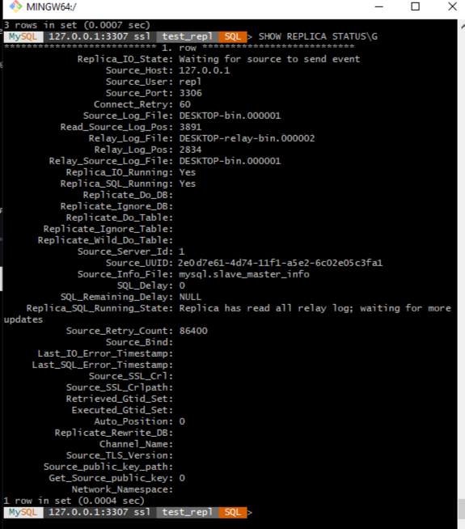
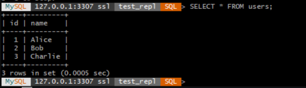
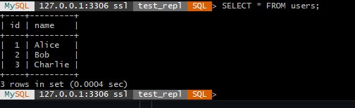

# Домашнее задание к занятию "`Репликация и масштабирование`" - `Борзенко Андрея`

### Задание 1

master-slave:
- все операции записи идут только на мастер;
- слейвы только читают и реплицируют изменения с мастера;
- репликация однонаправленная, master -> slave;
- в master‑slave пишет только один сервер.

master-master:
- каждый узел одновременно является и мастером, и слейвом;
- запись разрешена на любом узле, изменения реплицируются в обе стороны;
- в master‑master пишут несколько.

### Задание 2

Состояние репликации на слейве

Данные на слейве

Данные на мастере

